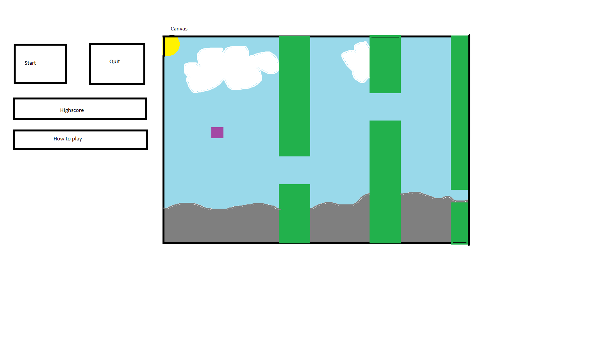

# Project Description

Developers: Daniel Lai Wikström & Eric Sandberg

The idea is to create a flappy bird like game using Javascript and HTML and then publish it to the internet using github pages.
To easily draw the graphics of the game we will use the HTML canvas.

Here is a quick sketch of how the game should look like in the early stages of developement.

## Week 1: Plan

- Picking a topic.
- Brainstorming.
- Decide programming language and GUI.
- Write Project Description.
- Research HTML and JS.

## Week 2: Develop

- Make a functioning game, it does not have to look pretty.
    - Make the tubes move continuously and add main character.
    - Collision detection.
    - Gravity.

## Week 3: Develop & Review

- Make the game pretty.
    - Maybe add some pixelart.